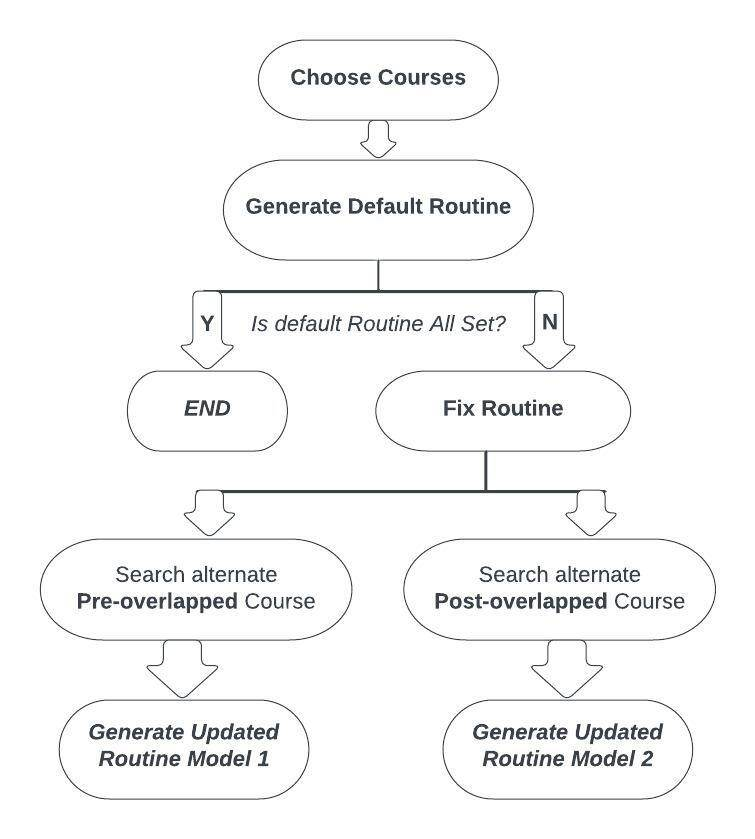
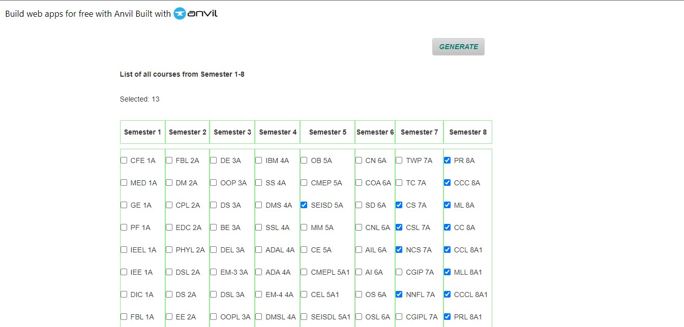

# RoutineGenRTR
AI Routine Generator/suggestor for PUC

Dear fellow students,

We are excited to share with you a new AI routine generator tool that we have created to simplify the process of creating class schedules!

As students ourselves, we know how daunting it can be to manually search for alternative sections when your desired courses overlap. That's why we've developed an AI routine generator that does the hard work for you. All you need to do is select your courses from 1-8 semesters, and our generator will instantly create a customized schedule for you.

But that's not all - if any of your courses overlap, the generator will automatically search for alternative sections and generate a new routine. We understand the frustration of having to suffer through this manual process, as one of our own friends Salman Monir had a tragic experience due to these calculations.

With this tool, we're hoping to make the scheduling process more manageable and less stressful for everyone. And while our current version generates two routines, we're already working on a third model that removes all courses and creates a schedule from scratch.

We would like to invite all students to use this tool and share their feedback with us. Let's make our academic lives easier together.  
URL: https://joyous-muffled-rabbit.anvil.app/   
(Course times will be updated once we get the routine)

Thank you!

Best regards,

Minhaz Mahmud  
Aryan Mashud Raj

# Workflow
<!--  -->

  

# Platform

  
  

  
  

